1. Table of Contents
{:toc}

--------------------------------------------------------------------------------------------------------------------

## **Acknowledgements**

* Original Source code from [AB3](https://se-education.org/addressbook-level3/).
* UI components via [JavaFX](https://openjfx.io/).
* Reused method to retrieve images as resources within JAR files was referenced from [mkyong](https://mkyong.com/java/java-read-a-file-from-resources-folder/).
* Fuzzy search algorithm via Soundex referenced from [Wikipedia](https://en.wikipedia.org/wiki/Soundex) with minor modifications.
* Incorporating Emojis in UI, referenced from [StackOverflow](https://stackoverflow.com/questions/22872484/javafx-how-can-i-display-emoji).
* Calculator feature referenced from [DaniWeb](https://www.daniweb.com/programming/software-development/threads/442690/java-expression-parser-calculator).

--------------------------------------------------------------------------------------------------------------------

## **Setting up, getting started**

Refer to the guide [_Setting up and getting started_](SettingUp.md).

--------------------------------------------------------------------------------------------------------------------

## **Design**

:bulb: **Tip:** The `.puml` files used to create diagrams in this document can be found in the [diagrams](https://github.com/AY2223S1-CS2103T-W09-1/tp/tree/master/docs/diagrams) folder. Refer to the [_PlantUML Tutorial_ at se-edu/guides](https://se-education.org/guides/tutorials/plantUml.html) to learn how to create and edit diagrams.

### Architecture

The ***Architecture Diagram*** given above explains the high-level design of the App.

Given below is a quick overview of main components and how they interact with each other.

**Main components of the architecture**

**`Main`** has two classes called [`Main`](https://github.com/AY2223S1-CS2103T-W09-1/tp/blob/master/src/main/java/seedu/boba/Main.java) and [`MainApp`](https://github.com/AY2223S1-CS2103T-W09-1/tp/blob/master/src/main/java/seedu/boba/MainApp.java). It is responsible for,
* At app launch: Initializes the components in the correct sequence, and connects them up with each other.
* At shut down: Shuts down the components and invokes cleanup methods where necessary.

[**`Commons`**](#common-classes) represents a collection of classes used by multiple other components.

The rest of the App consists of four components.

* [**`UI`**](#ui-component): The UI of the App.
* [**`Logic`**](#logic-component): The command executor.
* [**`BobaBotModel`**](#bobaBotModel-component): Holds the data of the App in memory.
* [**`Storage`**](#storage-component): Reads data from, and writes data to, the hard disk.

**How the architecture components interact with each other**

The *Sequence Diagram* below shows how the components interact with each other for the scenario where the user issues the command `delete p/87438807`.

Each of the four main components (also shown in the diagram above),

* defines its *API* in an `interface` with the same name as the Component.
* implements its functionality using a concrete `{Component Name}Manager` class (which follows the corresponding API `interface` mentioned in the previous point.

For example, the `Logic` component defines its API in the `Logic.java` interface and implements its functionality using the `LogicManager.java` class which follows the `Logic` interface. Other components interact with a given component through its interface rather than the concrete class (reason: to prevent outside component's being coupled to the implementation of a component), as illustrated in the (partial) class diagram below.

The sections below give more details of each component.

### UI component

The **API** of this component is specified in [`Ui.java`](https://github.com/AY2223S1-CS2103T-W09-1/tp/blob/master/src/main/java/seedu/boba/ui/Ui.java)

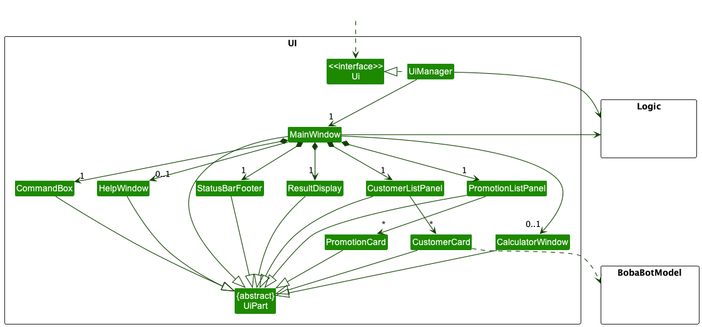

The UI consists of a `MainWindow` that is made up of parts e.g.`CommandBox`, `ResultDisplay`, `CustomerListPanel`, `StatusBarFooter` etc. All these, including the `MainWindow`, inherit from the abstract `UiPart` class which captures the commonalities between classes that represent parts of the visible GUI.

The `UI` component uses the JavaFx UI framework. The layout of these UI parts are defined in matching `.fxml` files that are in the `src/main/resources/view` folder. For example, the layout of the [`MainWindow`](https://github.com/AY2223S1-CS2103T-W09-1/tp/blob/master/src/main/java/seedu/boba/ui/MainWindow.java) 
is specified in [`MainWindow.fxml`](https://github.com/AY2223S1-CS2103T-W09-1/tp/blob/master/src/main/resources/view/MainWindow.fxml)

The `UI` component,

* executes user commands using the `Logic` component.
* listens for changes to `BobaBotModel` data so that the UI can be updated with the modified data.
* keeps a reference to the `Logic` component, because the `UI` relies on the `Logic` to execute commands.
* depends on some classes in the `BobaBotModel` component, as it displays `Customer` object residing in the `BobaBotModel`.

### Logic component

**API** : [`Logic.java`](https://github.com/AY2223S1-CS2103T-W09-1/tp/blob/master/src/main/java/seedu/boba/logic/Logic.java)

Here's a (partial) class diagram of the `Logic` component:

How the `Logic` component works:
1. When `Logic` is called upon to execute a command, it uses the `BobaBotParser` class to parse the user command.
1. This results in a `Command` object (more precisely, an object of one of its subclasses e.g., `AddCommand`) which is executed by the `LogicManager`.
1. The command can communicate with the `BobaBotModel` when it is executed (e.g. to add a customer).
1. The result of the command execution is encapsulated as a `CommandResult` object which is returned back from `Logic`.

The Sequence Diagram below illustrates the interactions within the `Logic` component for the `execute("delete p/12345678")` API call.

:information_source: **Note:** The lifeline for `DeleteCommandParser` should end at the destroy marker (X) but due to a limitation of PlantUML, the lifeline reaches the end of diagram.

Here are the other classes in `Logic` (omitted from the class diagram above) that are used for parsing a user command:

How the parsing works:
* When called upon to parse a user command, the `BobaBotParser` class creates an `XYZCommandParser` (`XYZ` is a placeholder for the specific command name e.g., `AddCommandParser`) which uses the other classes shown above to parse the user command and create a `XYZCommand` object (e.g., `AddCommand`) which the `BobaBotParser` returns back as a `Command` object.
* All `XYZCommandParser` classes (e.g., `AddCommandParser`, `DeleteCommandParser`, ...) inherit from the `Parser` interface so that they can be treated similarly where possible e.g, during testing.

### Command Classes

The class diagram below expands the details of Command and Parser part in the Logic component above, showing the details of how commands are parsed and created

Simple commands without arguments including `clear` `list` `exit` `help` are created directly by `BobaBotParser` 
To parse complex commands with arguments, including `add` `find` `edit` `delete`, `BobaBotParser` will create customized commandParser corresponding to the command.  
The customized commandParser will parse the arguments and create the command

The diagram also includes some new classes involved. For example, the `find` command depends on new predicates in the `BobaBotModel` component to allow all-info and fuzzy search (more detail in the `find` command description)

### BobaBotModel component

**API** : [`BobaBotModel.java`](https://github.com/AY2223S1-CS2103T-W09-1/tp/blob/master/src/main/java/seedu/boba/model/BobaBotModel.java)

The `BobaBotModel` component,

* stores the bobaBot data i.e., all `Customer` objects (which are contained in a `UniqueCustomerList` object).
* stores the currently 'selected' `Customer` objects (e.g., results of a search query) as a separate _filtered_ list which is exposed to outsiders as an unmodifiable `ObservableList<Customer>` that can be 'observed' e.g. the UI can be bound to this list so that the UI automatically updates when the data in the list change.
* stores a `UserPref` object that represents the user’s preferences. This is exposed to the outside as a `ReadOnlyUserPref` objects.
* does not depend on any of the other three components (as the `BobaBotModel` represents data entities of the domain, they should make sense on their own without depending on other components)

:information_source: **Note:** An alternative (arguably, a more OOP) bobaBotModel is given below. It has a `Tag` list in the `BobaBot`, which `Customer` references. This allows `BobaBot` to only require one `Tag` object per unique tag, instead of each `Customer` needing their own `Tag` objects. 

### Storage component

**API** : [`Storage.java`](https://github.com/AY2223S1-CS2103T-W09-1/tp/blob/master/src/main/java/seedu/boba/storage/Storage.java)

The `Storage` component,
* can save both bobaBot data and user preference data in json format, and read them back into corresponding objects.
* inherits from both `BobaBotStorage` and `UserPrefStorage`, which means it can be treated as either one (if only the functionality of only one is needed).
* depends on some classes in the `BobaBotModel` component (because the `Storage` component's job is to save/retrieve objects that belong to the `BobaBotModel`)

### Common classes

Classes used by multiple components are in the `seedu.boba.commons` package.

--------------------------------------------------------------------------------------------------------------------

## **Implementation**

This section describes some noteworthy details on how certain features are implemented.
### Add feature
The Add feature is facilitated by `LogicManager`. The `AddCommandParser` parses the command arguments, and returns
an `AddCommand` that is executed by the `LogicManager`.

This feature allows the user to add a new Customer.

**Below is a sample usage and how the add sequence behaves at each step.**

1. User chooses the Customer he/she wants to add and enters the command `add n/Bob p/12345678 e/johnd@example.com m/1 r/5000 t/GOLD t/MEMBER`
2. The `LogicManager` redirects this command to `BobaBotParser`, which parses the command via `AddCommandParser` and
   returns the `AddCommand` containing the Customer with all the required fields
3. The `LogicManager` executes the `AddCommand` and Customer is added to database
4. The `CommandResult` reflects this Customer

The following sequence diagram shows how the add feature works, following the flow of entering the command `add n/Bob p/12345678 e/johnd@example.com m/1 r/5000 t/GOLD t/MEMBER`:

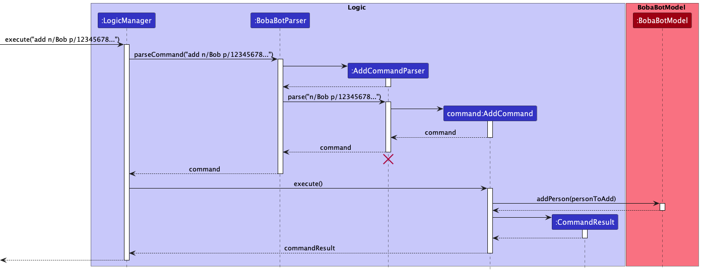

The following activity diagram summarizes the flow of when a user enters an add command:

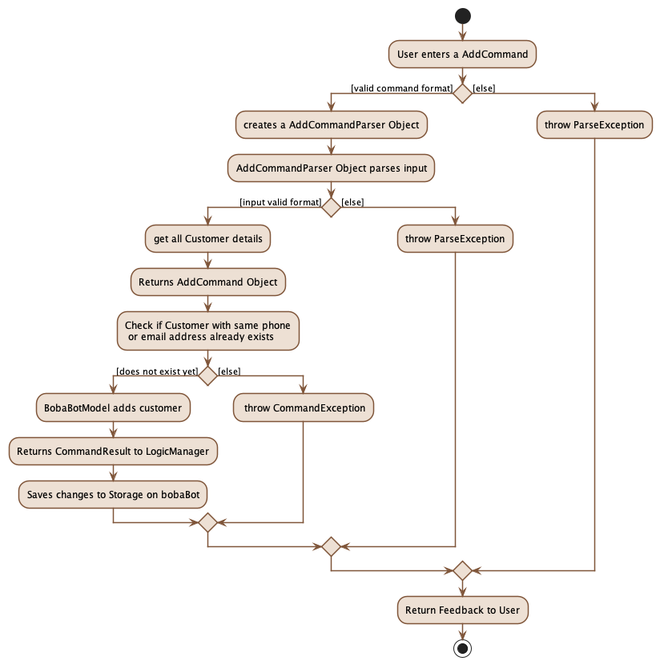

**Aspect: How `add` is executed**
* **Alternative 1 (current choice):** User can only add a customer with unique `PHONE_NUMBER` and `EMAIL` that does not already exist in database.

  | Pros/Cons | Description                                                                                                                                 | Examples                                                                                                                                                                      |
      |---------------------------------------------------------------------------------------------------------------------------------------------|-------------------------------------------------------------------------------------------------------------------------------------------------------------------------------|----------------------------------------------------------------------------------------------------------------------------------------|
  | Pros      | Allows user to add customers with same names but different phone numbers and email addresses                                                | The user can add Alex with phone number `99999999` and a different Alex with phone number `88888888`, where Alex is not a unique name.                                        |
  | Cons      | If an existing customer changes phone number, and a new customer uses this customer's previous phone number, we cannot add the new customer | Alex changes his phone number from `99999999` to `88888888`, Bob got Alex's old phone number `99999999`, we cannot sign Bob up for membership without editing Alex's details. |

* **Alternative 2:** User can only add a customer with unique `NAME`.

  | Pros/Cons | Description                                                                                  | Examples                                                                                                       |
      |----------------------------------------------------------------------------------------------|----------------------------------------------------------------------------------------------------------------|-------------------------------------------------------------------------------------------------------------------------------------------------------------------------------------------------------------------------------------------------------------|
  | Pros      | Customers can choose not to disclose private details such as phone number and email address. | The user just needs to `add n/Bob` without asking for phone number or email address.                           |
  | Cons      | User cannot add customers that have same names.                                              | The user cannot `add n/Alex` if there already exists an `Alex` in the database, since `Alex` is a common name. |

* **Future Extension:** bobaBot can support autocompletion of prefixes to reduce keystrokes for the user.

### Edit feature
The Edit feature is facilitated by `LogicManager`. The `EditCommandParser` parses the command arguments, and returns
an `EditCommand` that is executed by the `LogicManager`.

This feature allows the user to edit any fields of a Customer, and supports editing multiple fields at once.

**Below is a sample usage and how the edit sequence behaves at each step.**

1. User chooses the Customer he/ she wants to edit and enters the command `edit e/test@gmail/com n/Bob`
2. The `LogicManager` redirects this command to `BobaBotParser`, which parses the command via `EditCommandParser` and
returns the `EditCommand` containing the Customer with all the new fields that are supposed to be edited to
3. The `LogicManager` executes the `EditCommand` and Customer to be edited is updated with the new fields
4. The `CommandResult` reflects the changes made to this Customer

The following sequence diagram shows how the edit feature works, following the flow of entering the command `edit e/test@gmail/com n/Bob`:

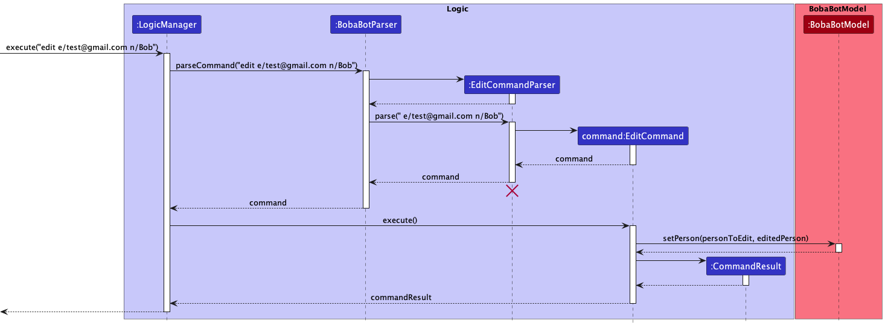

The following activity diagram summarizes the flow of when a user enters an edit command:

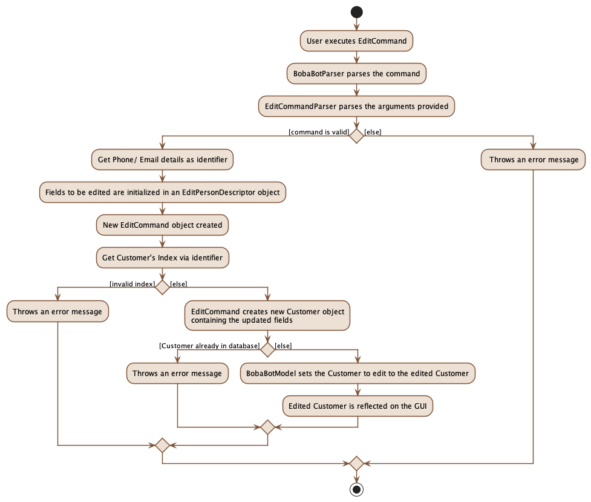

**Aspect: How `edit` is executed**
* **Alternative 1 (current choice):** User can edit a customer via either `PHONE_NUMBER` or `EMAIL`.

  | Pros/Cons | Description                                                                          | Examples                                                                                                                                    |
    |--------------------------------------------------------------------------------------|---------------------------------------------------------------------------------------------------------------------------------------------|----------------------------------------------------------------------------------------------------------------------------------------|
  | Pros      | Allows user more flexibility in choosing the inputs as identifiers for editing       | The user can edit any customer as long as they have details of either their `PHONE_NUMBER` or `EMAIL`.                                      |
  | Pros      | The user does not need to know the specific position of the customer within the list | The user can use either identifier `PHONE_NUMBER` or `EMAIL` to edit customers without a need for their index/position.                     |
  | Cons      | The length of the command is longer with the new identifiers                         | The user has to type `edit p/12345678 n/Bob` or `edit e/test@gmail.com n/Bob` to edit a user which is longer compared to editing via index. |

* **Alternative 2:** User can edit a customer via `index`.

  | Pros/Cons | Description                                                                                               | Examples                                                                                                                                                                                                                                            |
    |-----------------------------------------------------------------------------------------------------------|-----------------------------------------------------------------------------------------------------------------------------------------------------------------------------------------------------------------------------------------------------|-------------------------------------------------------------------------------------------------------------------------------------------------------------------------------------------------------------------------------------------------------------|
  | Pros      | Short commands enable fast editing                                                                        | The user can edit any customer as long as they have details of the `index` of the customer, e.g. `edit 1`.                                                                                                                                          |
  | Cons      | Identifying the customer via `index` might be slow especially when there are customers with similar names | The user has to find out the `index` of the customer to edit before typing the command. Supposed that we want to edit Bob and there exists an Bob and bob, identifying the correct customer takes time and thus delay the execution of the command. |

* **Future Extension:** bobaBot can support multiple editing so user do not have to edit customers one by one.

### Increase/ Decrease feature
The Increase/ Decrease feature is facilitated by `LogicManager`. The `IncreaseCommandParser` or `DecreaseCommandParser` parses the command arguments, and returns
an `IncreaseCommand` or `DecreaseCommand` that is executed by the `LogicManager`.

This feature is an extension to the above Edit feature to ease the process of editing Reward points of a Customer.

**Below is a sample usage and how the increase/ decrease sequence behaves at each step.**

1. User chooses the Customer he/ she wants to increase or decrease the Reward points for and enters the command `incr 100 e/test@gmail/com` or `decr 100 e/test@gmail/com`
2. The `LogicManager` redirects this command to `BobaBotParser`, which parses the command via `IncreaseCommandParser` or `DecreaseCommandParser` and
   returns the `IncreaseCommand` or `DecreaseCommand` containing how much to increment or decrement the existing Reward points by
3. The `LogicManager` executes the `IncreaseCommand` or `DecreaseCommand` which implicitly creates and executes the equivalent `EditCommand` for the new Reward value
4. The `CommandResult` reflects the changes made to this Customer

**Pros and Cons are the same as the above Edit Feature.**

### Delete feature
The Delete feature is facilitated by `LogicManager`. The `DeleteCommandParser` parses the command arguments, and returns
a `DeleteCommand` that is executed by the `LogicManager` and returns a `CommandResult` as feedback to the user.

This feature enables the user to remove a customer from bobaBot via either the `PHONE` or `EMAIL` identifier.

**Below is a sample usage and how the delete sequence behaves at each step.**

1. User chooses the Customer he/she wants to delete and enters the command `delete p/12345678`
2. The `MainWindow` class retrieves the user's input and passes it on to the `LogicManager` through the `execute` method
3. The `LogicManager` redirects this command to `BobaBotParser` via the `parseCommand` method and creates a temporary `DeleteCommandParser` object 
4. The `DeleteCommandParser` object parses the command and returns the `DeleteCommand` containing the details of the Customer to delete
5. The `LogicManager` executes the `DeleteCommand`, removing the Customer from bobaBot and returning a `CommandResult` object
6. The `CommandResult` reflects the removal of this Customer

The sequence diagram below shows how the `delete` feature parsing an input `p/12345678` behaves at each step.

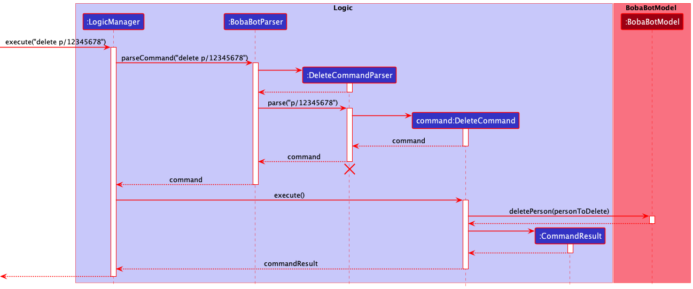

The activity diagram below illustrates how the `delete` operation works.

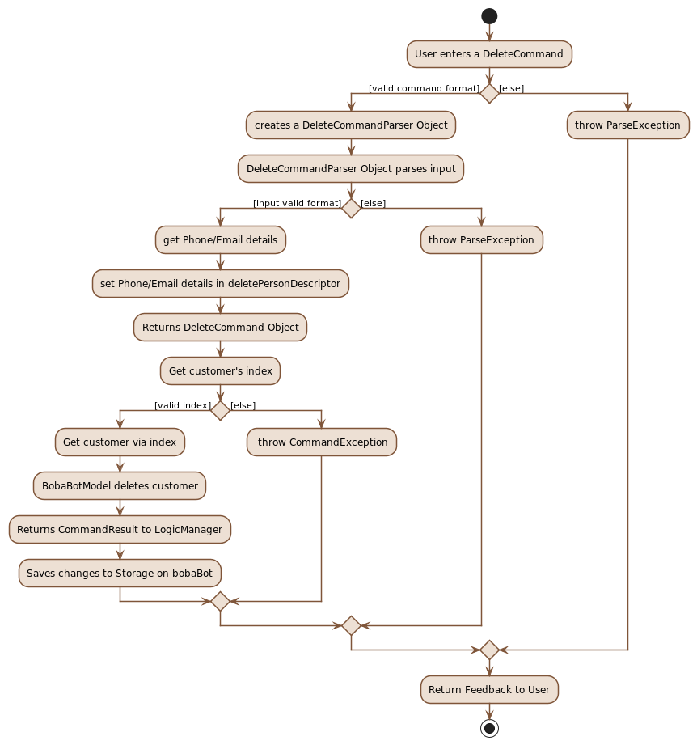

**Aspect: How `delete` is executed**
* **Alternative 1 (current choice):** User can delete a customer via either `PHONE_NUMBER` or `EMAIL`.

  | Pros/Cons | Description                                                                          | Examples                                                                                                                               |
  |-----------|--------------------------------------------------------------------------------------|----------------------------------------------------------------------------------------------------------------------------------------|
  | Pros      | Allows user more flexibility in choosing the inputs as identifiers for deletion      | The user can delete any customer as long as they have details of either their `PHONE_NUMBER` or `EMAIL`.                               |
  | Pros      | The user does not need to know the specific position of the customer within the list | The user can use either identifier `PHONE_NUMBER` or `EMAIL` to delete customers without a need for their index/position.              |
  | Cons      | The length of the command is longer with the new identifiers                         | The user has to type `delete p/12345678` or `delete e/test@gmail.com` to delete a user which is longer compared to deleting via index. |

* **Alternative 2:** User can delete a customer via `index`.

  | Pros/Cons | Description                                                                                               | Examples                                                                                                                                                                                                                                                    |
  |-----------|-----------------------------------------------------------------------------------------------------------|-------------------------------------------------------------------------------------------------------------------------------------------------------------------------------------------------------------------------------------------------------------|
  | Pros      | Short commands enable fast deletion                                                                       | The user can delete any customer as long as they have details of the `index` of the customer, e.g. `delete 1`.                                                                                                                                              |
  | Cons      | Identifying the customer via `index` might be slow especially when there are customers with similar names | The user has to find out the `index` of the customer to delete before typing the command. Supposed that we want to delete Alex and there exists an Alex and alex, identifying the correct customer takes time and thus delay the execution of the command.  |

* **Future Extension:** bobaBot can support multiple deletions so user do not have to delete customers one by one.

### Find feature
The Find feature is facilitated by `LogicManager`. The `FindCommandParser` parses the command arguments, and returns
an `FindCommand` that is executed by the `LogicManager`.

This feature allows the user to find a specific user by field, or generally search for occurrences of keywords in all fields.
The feature also supports fuzzy search based on `Soundex` when searching by names.

**Below is a sample usage and how the find sequence behaves at each step.**

1. User chooses the Customer he/ she wants to find and enters the command `find Aschcroft`
2. The `LogicManager` redirects this command to `BobaBotParser`, which parses the command via `FindCommandParser` and
   returns the `FindCommand` containing the predicate
3. The `LogicManager` executes the `FindCommand` and update the filtered list with matching `Customer`
4. The `CommandResult` reflects the number of customers listed

The following sequence diagram shows how the find feature works, following the flow of entering the command `find Aschcroft`:

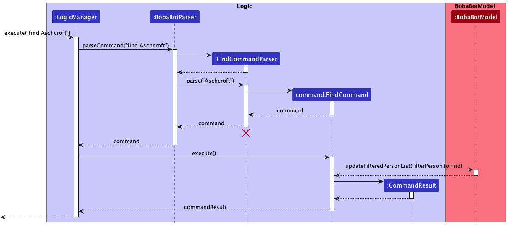

The following activity diagram summarizes the flow of when a user enters a find command:

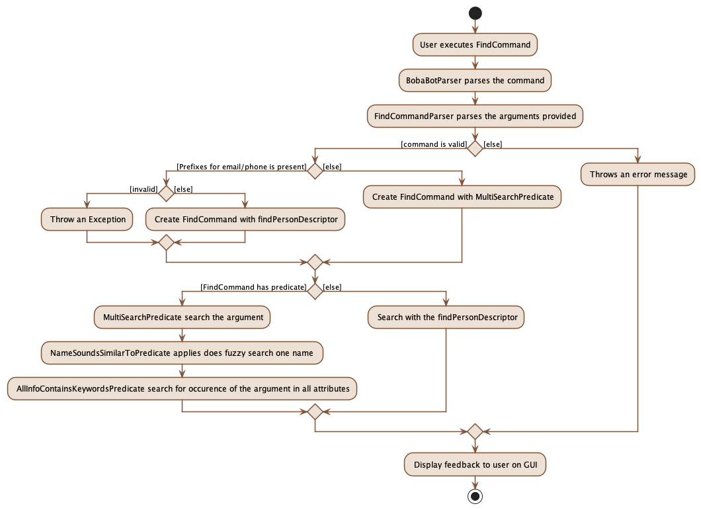

**Aspect: How `find` is executed**
* User can search for a specific customer via `PHONE_NUMBER` or `EMAIL`,
or just search for occurrence of keywords (including name) vaguely.

  | Pros/Cons | Description                                                                     | Examples                                                                                    |
      |---------------------------------------------------------------------------------|---------------------------------------------------------------------------------------------|----------------------------------------------------------------------------------------------------------------------------------------|
  | Pros      | User can find the desired entry easily with a short command                     | For searching a customer with phone number `88888888`, the command `find 88888888` will do. |
  | Pros      | User can also search for a specific entry when needed.                          | For searching the specific customer with email address, use `find e/address@example.com`.   |
  | Cons      | User can exploit the software and get access to irrelevant customer information | User can list out all customers with digit `8` in their phone number by `find 8`.           |

* **Future Extension:** bobaBot can support priority in listing of search results.

### Undo/Redo feature

The undo/redo mechanism is facilitated by `VersionedBobaBot`. It extends `BobaBot` with an undo/redo history, stored internally as an `bobaBotStateList` and `currentStatePointer`. Additionally, it implements the following operations:

* `VersionedBobaBot#commit()` — Saves the current bobaBot state in its history if it differs from the previously saved state.
* `VersionedBobaBot#undo()` — Restores the previous bobaBot state from its history as long as it is not in its initialised state.
* `VersionedBobaBot#redo()` — Restores a previously undone bobaBot state from its history as long as it is not in the most updated state.

These operations are exposed in the `BobaBotModel` interface as `BobaBotModel#commitBobaBot()`, `BobaBotModel#undoBobaBot()` and `BobaBotModel#redoBobaBot()` respectively.

:information_source: **Note:** The bobaBotStatelist only keeps track of 20 of the most recent state changes! This is by design to minimise the storage space required for bobaBot application. However, you may configure the limit depending on your needs.

Given below is an example usage scenario and how the undo/redo mechanism behaves at each step.

Step 1. The user launches the application for the first time. The `VersionedBobaBot` will be initialized with the initial bobaBot state, and the `currentStatePointer` pointing to that single bobaBot state.

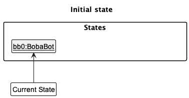

Step 2. The user executes `delete p/87438807` command to delete the customer with phone number `87438807` which corresponds to `Alex Yeoh` from the bobaBot. The `delete` command calls `BobaBotModel#commitBobaBot()`, causing the modified state of the bobaBot after the `delete p/87438807` command executes to be saved in the `bobaBotStateList`, and the `currentStatePointer` is shifted to the newly inserted bobaBot state.

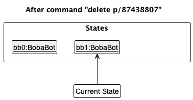

Step 3. The user executes `add n/David …​` to add a new customer. The `add` command also calls `BobaBotModel#commitBobaBot()`, causing another modified bobaBot to be saved into the `bobaBotStateList`.

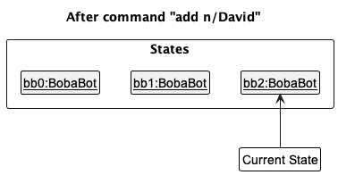

:information_source: **Note:** If a command fails its execution, it will not call `BobaBotModel#commitBobaBot()`, so the bobaBot state will not be saved into the `bobaBotStateList`.

Step 4. The user now decides that adding the customer was a mistake, and decides to undo that action by executing the `undo` command. The `undo` command will call `BobaBotModel#undoBobaBot()`, which will shift the `currentStatePointer` once to the left, pointing it to the previous bobaBot state, and restores the bobaBot to that state.

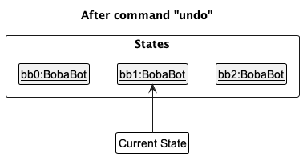

:information_source: **Note:** If the `currentStatePointer` is at index 0, pointing to the initial bobaBot state, then there are no previous bobaBot states to restore. The `undo` command uses `BobaBotModel#canUndoBobaBot()` to check if this is the case. If so, it will return an error to the user rather
than attempting to perform the `undo` command.

The following sequence diagram shows how the undo operation works:

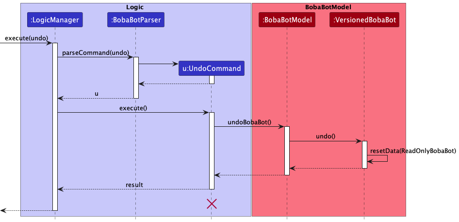

:information_source: **Note:** The lifeline for `UndoCommand` should end at the destroy marker (X) but due to a limitation of PlantUML, the lifeline reaches the end of diagram.

The `redo` command does the opposite — it calls `BobaBotModel#redoBobaBot()`, which shifts the `currentStatePointer` once to the right, pointing to the previously undone state, and restores the bobaBot to that state.

:information_source: **Note:** If the `currentStatePointer` is at index `bobaBotStateList.size() - 1`, pointing to the latest bobaBot state, then there are no undone bobaBot states to restore. The `redo` command uses `BobaBotModel#canRedoBobaBot()` to check if this is the case. If so, it will return an error to the user rather than attempting to perform the redo.

Step 5. The user then decides to execute the command `list`. Commands that do not modify the bobaBot, such as `list`, will usually not call `BobaBotModel#commitBobaBot()`, `BobaBotModel#undoBobaBot()` or `BobaBotModel#redoBobaBot()`. Thus, the `bobaBotStateList` remains unchanged.

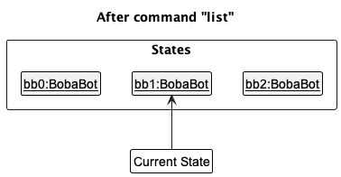

Step 6. The user executes `clear`, which calls `BobaBotModel#commitBobaBot()`. Since the `currentStatePointer` is not pointing at the end of the `bobaBotStateList`, all bobaBot states after the `currentStatePointer` will be purged. Reason: It no longer makes sense to redo the `add n/David …​` command. This is the behavior that most modern desktop applications follow.

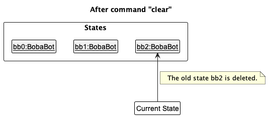

The following activity diagram summarizes what happens when a user executes a new command:

**Aspect: How undo & redo executes:**

* **Alternative 1 (current choice):** Saves the entire bobaBot.
  * Pros: Easy to implement.
  * Cons: May have performance issues in terms of memory usage.

* **Alternative 2:** Individual command knows how to undo/redo by
  itself.
  * Pros: Will use less memory (e.g. for `delete`, just save the customer being deleted).
  * Cons: We must ensure that the implementation of each individual command are correct.

### \[Proposed\] Data archiving

_{Explain here how the data archiving feature will be implemented}_

--------------------------------------------------------------------------------------------------------------------

## **Documentation, logging, testing, configuration, dev-ops**

* [Documentation guide](Documentation.md)
* [Testing guide](Testing.md)
* [Logging guide](Logging.md)
* [Configuration guide](Configuration.md)
* [DevOps guide](DevOps.md)

--------------------------------------------------------------------------------------------------------------------

## **Appendix: Requirements**

### Product scope

**Target user profile**:

* has a need to manage a significant number of customers
* interacts with a lot of customers, especially during peak hours
* can type fast
* prefers typing to mouse interactions
* never used CLI before

**Value proposition**: manage customers faster than a typical mouse/GUI driven app

### User stories

Priorities: High (must have) - `* * *`, Medium (nice to have) - `* *`, Low (unlikely to have) - `*`

| Priority | As a …​ | I want to …​                                                                   | So that I can…​                                                                  |
|----------|---------|--------------------------------------------------------------------------------|----------------------------------------------------------------------------------|
| `* * *`  | cashier | quickly search for customers’ membership details within the system             | verify their rewards/points                                                      |
| `* * *`  | cashier | search for customer details through various inputs (email, phone number, name) | retrieve their information flexibly                                              |
| `* * *`  | cashier | edit customers' membership details (vouchers, points, rewards)                 | remove the voucher/points once they claim them                                   |
| `* * *`  | cashier | add new members to my list                                                     | apply for membership for customers                                               |
| `* * *`  | cashier | remove members from the list                                                   | make sure membership details are correct for customers who are no longer members |

### Use cases

(For all use cases below, the **System** is `bobaBot` and the **Actor** is the `user`, unless specified otherwise)

**Use case 1: Add a Customer**

System: bobaBot  
Use case: UC01 - Add a Customer  
Actor: User  
Guarantee: New Customer will be added into bobaBot.

**MSS**

1. User requests to add a Customer.
2. bobaBot adds the Customer into the database.

    Use case ends.

**Extensions**

* 1a. User enters the command wrongly.
  * 1a1. bobaBot displays the error message.

    Use case ends.

**Use case 2: Delete a Customer**

System: bobaBot  
Use case: UC02 - Delete a Customer  
Actor: User  
Guarantee: Selected Customer will be deleted from bobaBot.

**MSS**

1. User requests to delete a Customer.
2. bobaBot deletes the Customer from the database.

    Use case ends.

**Extensions**

* 1a. User enters the command wrongly.
    * 1a1. bobaBot displays the error message.

      Use case ends.
    
* 1b. User enters a Customer that does not exist in bobaBot's database.
    * 1b1. bobaBot displays that the Customer does not exist.

      Use case ends.

**Use case 3: Find a Customer**

System: bobaBot  
Use case: UC03 - Find a Customer  
Actor: User  
Guarantee: Selected Customer's details will be displayed by bobaBot.

**MSS**

1. User requests to find a Customer.
2. bobaBot displays the Customer's details from the database.

   Use case ends.

**Extensions**

* 1a. User enters the command wrongly.
    * 1a1. bobaBot displays the error message.

      Use case ends.
    
* 1b. User enters a Customer that does not exist in bobaBot's database.
    * 1b1. bobaBot displays that the Customer does not exist.

      Use case ends.

* 1c. User enters a keyword with no matching results.
    * 1c1. bobaBot displays an empty list.

      Use case ends.

**Use case 4: Edit a Customer's details**

System: bobaBot  
Use case: UC04 - Edit a Customer's details  
Actor: User  
Guarantee: Selected Customer's details will be edited by bobaBot.

**MSS**

1. User requests to edit a Customer's details.
2. bobaBot edits the Customer's details in the database.

   Use case ends.

**Extensions**

* 1a. User enters the command wrongly.
    * 1a1. bobaBot displays the error message.

      Use case ends.
    
* 1b. User enters a Customer that does not exist in bobaBot's database.
    * 1b1. bobaBot displays that the Customer does not exist.

      Use case ends.
    
* 1c. bobaBot encounters a duplicate of the edited Customer in its database.
    * 1c1. bobaBot displays a warning on potential the duplicate.
    * 1c2. bobaBot provides the option to delete one of the duplicates (UC02)

      Use case resumes from step 2.

**Use case 5: Increase a Customer's Reward points**

System: bobaBot  
Use case: UC05 - Increase a Customer's Reward points 
Actor: User  
Guarantee: Selected Customer's Reward points will be incremented by bobaBot.

**MSS**

1. User requests to increase a Customer's reward points.
2. bobaBot increments the Customer's reward points in the database.

   Use case ends.

**Extensions**

* 1a. User enters the command wrongly.
    * 1a1. bobaBot displays the error message.

      Use case ends.

* 1b. User enters a Customer that does not exist in bobaBot's database.
    * 1b1. bobaBot displays that the Customer does not exist.

      Use case ends.

* 1c. Final incremented value of Reward points exceeds maximum integer value (2147483647).
    * 1c1. bobaBot displays the error message.

      Use case ends.

**Use case 6: Decrease a Customer's Reward points**

System: bobaBot  
Use case: UC06 - Decrease a Customer's Reward points 
Actor: User  
Guarantee: Selected Customer's Reward points will be decremented by bobaBot.

**MSS**

1. User requests to decrease a Customer's reward points.
2. bobaBot decrements the Customer's reward points in the database.

   Use case ends.

**Extensions**

* 1a. User enters the command wrongly.
    * 1a1. bobaBot displays the error message.

      Use case ends.

* 1b. User enters a Customer that does not exist in bobaBot's database.
    * 1b1. bobaBot displays that the Customer does not exist.

      Use case ends.

* 1c. Final decremented value of Reward points becomes negative in value.
    * 1c1. bobaBot displays the error message.

      Use case ends.

**Use case 7: Undo a wrong Command**

System: bobaBot  
Use case: UC07 - Undo a wrong Command 
Actor: User  
Guarantee: bobaBot will be reverted to the previous state before the wrong Command was executed.

**MSS**

1. User requests to undo a command.
2. bobaBot will undo the latest Command that was executed.

   Use case ends.

**Extensions**

* 1a. There is no previous Command to undo.
    * 1a1. bobaBot displays the error message.

      Use case ends.

**Use case 8: Redo an unintended Undo Command**

System: bobaBot  
Use case: UC08 - Redo an unintended Undo Command 
Actor: User  
Guarantee: bobaBot will revert back to the state after the Command was executed.

**MSS**

1. User requests to redo a command.
2. bobaBot will re-execute the Command that was undone previously.

   Use case ends.

**Extensions**

* 1a. There is no previous Undo Command to redo.
    * 1a1. bobaBot displays the error message.

      Use case ends.

**Use case 9: Calculate change to be given to Customer**

System: bobaBot  
Use case: UC09 -  Calculate change to be given to Customer 
Actor: User  

**MSS**

1. User requests to calculate the amount of change to give back to the Customer.
2. bobaBot will compute the amount and return the value.

   Use case ends.

**Use case 10: Exit bobaBot**

System: bobaBot  
Use case: UC10 - Exit bobaBot  
Actor: User  
Guarantee: bobaBot will be exited.

**MSS**

1. User requests to exit bobaBot.
2. bobaBot exits.

   Use case ends.

### Non-Functional Requirements

1.  Should work on any _mainstream OS_ as long as it has Java `11` or above installed.
2.  Should be able to hold up to 1000 cashiers at bubble tea shops without a noticeable sluggishness in performance for typical usage.
3.  A user with above average typing speed for regular English text (i.e. not code, not system admin commands) should be able to accomplish most of the tasks faster using commands than using the mouse.
4.  The system should respond fast within 0.5 second, so as to speed up the ordering at counters
5.  bobaBot should be able to work on any computers, either 32-bit or 64-bit, slow or fast, as the computers at counters may be old and slow
6.  The database should be able to handle frequent changes of data efficiently
7.  bobaBot should be usable by workers who are not familiar with command lines, and easy to learn
8.  The management of customers' data should follow PDPA
9.  Should work when some data is missing or inaccurate
10. The source code should be open source
11. The source code and project management should follow the requirements and principles in CS2103T
12. Should handle large amount of customers' data, like 10,000 customers

### Glossary

* **Mainstream OS**: Windows, Linux, Unix, OS-X
* **Private contact detail**: A contact detail that is not meant to be shared with others
* **User**: The staff of the boba shop
* **Customer**: The customer of the boba shop
* **Customer's detail**: Any information in the system related to the customer

--------------------------------------------------------------------------------------------------------------------

## **Appendix: Instructions for manual testing**

Given below are instructions to test the app manually.

:information_source: **Note:** These instructions only provide a starting point for testers to work on;
testers are expected to do more *exploratory* testing.

### Launch and shutdown

1. Initial launch

   1. Download the jar file and copy into an empty folder

   1. Double-click the jar file Expected: Shows the GUI with a set of sample contacts. The window size may not be optimum.

1. Saving window preferences

   1. Resize the window to an optimum size. Move the window to a different location. Close the window.

   1. Re-launch the app by double-clicking the jar file. 
       Expected: The most recent window size and location is retained.

### Adding a customer

1. Adding a customer to bobaBot

   1. Prerequisites: Ensure that you have the following details:
      1. Name (prefix: n/)
      2. Phone Number (prefix p/)
      3. Email (prefix e/)
      4. Rewards (prefix r/)
      5. Birthday Month (prefix m/)
      6. Tags (prefix t/)(optional)

   2. Test case: `add n/John Doe p/98765432 e/johnd@example.com m/1 r/0` 
      Expected: A successful message will be shown in the status message indicating that a new customer is added into bobaBot with the corresponding particulars.

   3. Test case: `add n/Charlie Puth p/81234567 e/charlie@puth.com r/3000 t/silver m/12`
      Expected: A successful message will be shown in the status message indicating that a new customer is added into bobaBot with the corresponding particulars.

   4. Test case: `add n/Charlie Puth p/81234567`
      Expected: An error message for invalid format will be shown in the status message as it is missing the required particulars.

   5. Other incorrect add commands to try: `add`, `add p/`, `add hello`, `...` 
      Expected: Similar to previous.

### Editing a customer

1. Editing a customer via `PHONE_NUMBER`

    1. Prerequisites: Ensure that the sample data is loaded with customers `Alex Yeoh`, `Bernice Yu`,... when launching the JAR file

    2. Test case: `edit p/87438807 p/12345678` 
       Expected: The customer with`PHONE_NUMBER` corresponding to `87438807` (in this case `Alex Yeoh`) will have his phone number edited to `12345678`. Details of the edited customer is shown in the status message.

    3. Test case: `edit p/11111111 p/12345678` 
       Expected: No customer is edited since `11111111` does not correspond to any customer's `PHONE_NUMBER`. Error details shown in the status message.

    4. Other incorrect edit commands to try: `edit`, `edit p/`, `edit hello`, `...` 
       Expected: Invalid edit command format error message will be shown in the status message.

2. Editing a customer via `EMAIL`

    1. Prerequisites: Ensure that the sample data is loaded with customers `Alex Yeoh`, `Bernice Yu`,... when launching the JAR file

    2. Test case: `edit e/charlotte@example.com e/snorlax@gmail.com` 
       Expected: The customer with `EMAIL` corresponding to `charlotte@example.com` (in this case `Charlotte Oliveiro`) will have her email edited to `snorlax@gmail.com`. Details of the edited customer is shown in the status message.

    3. Test case: `edit e/bruno@mars.com e/snorlax@gmail.com` 
       Expected: No customer is edited since `bruno@mars.com` does not correspond to any customer's `EMAIL`. Error details shown in the status message.

    4. Other incorrect edit commands to try: `edit`, `edit e/`, `edit hello`, `...` 
       Expected: Invalid edit command format error message will be shown in the status message.

### Increasing a customer's reward

1. Increase a customer's reward via `PHONE_NUMBER`

    1. Prerequisites: Ensure that the sample data is loaded with customers `Alex Yeoh`, `Bernice Yu`,... when launching the JAR file

    2. Test case: `incr 1000 p/87438807` 
       Expected: The reward of customer with `PHONE_NUMBER` corresponding to `87438807` (in this case `Alex Yeoh`) will be increased by 1000. Edited customer's detail shown in the status message

    3. Test case: `incr 1000 p/11111111` 
       Expected: No customer's reward is increased since `11111111` does not correspond to any customer's `PHONE_NUMBER`. Error details shown in the status message.

    4. Other incorrect increment commands to try: `incr`, `incr p/87438807`, `incr p/`, `incr hello`, `...` 
       Expected: Similar to previous.

2. Increase a customer's reward via `EMAIL`

    1. Prerequisites: Ensure that the sample data is loaded with customers `Alex Yeoh`, `Bernice Yu`,... when launching the JAR file

    2. Test case: `incr 1000 e/charlotte@example.com` 
       Expected: The reward of customer with `EMAIL` corresponding to `charlotte@example.com` (in this case `Charlotte Oliveiro`) will be increased by 1000. Edited customer's detail shown in the status message.

    3. Test case: `incr e/bruno@mars.com` 
       Expected: No customer's reward is increased since `bruno@mars.com` does not correspond to any customer's `EMAIL`. Error details shown in the status message.

    4. Other incorrect increment commands to try: `incr`, `incr e/charlotte@example.com`, `incr e/`, `incr hello`, `...` 
       Expected: Similar to previous.

### Decreasing a customer's reward

1. Decrease a customer's reward via `PHONE_NUMBER`

    1. Prerequisites: Ensure that the sample data is loaded with customers `Alex Yeoh`, `Bernice Yu`,... when launching the JAR file

    2. Test case: `decr 1000 p/87438807` 
       Expected: The reward of customer with `PHONE_NUMBER` corresponding to `87438807` (in this case `Alex Yeoh`) will be increased by 1000. Edited customer's detail shown in the status message

    3. Test case: `decr 1000 p/11111111` 
       Expected: No customer's reward is increased since `11111111` does not correspond to any customer's `PHONE_NUMBER`. Error details shown in the status message.

    4. Other incorrect increment commands to try: `decr`, `decr p/87438807`, `decr p/`, `decr hello`, `...` 
       Expected: Similar to previous.

2. Decrease a customer's reward via `EMAIL`

    1. Prerequisites: Ensure that the sample data is loaded with customers `Alex Yeoh`, `Bernice Yu`,... when launching the JAR file

    2. Test case: `decr 1000 e/charlotte@example.com` 
       Expected: The reward of customer with `EMAIL` corresponding to `charlotte@example.com` (in this case `Charlotte Oliveiro`) will be decreased by 1000. Edited customer's detail shown in the status message.

    3. Test case: `decr e/bruno@mars.com` 
       Expected: No customer's reward is increased since `bruno@mars.com` does not correspond to any customer's `EMAIL`. Error details shown in the status message.

    4. Other incorrect increment commands to try: `decr`, `decr e/charlotte@example.com`, `decr e/`, `decr hello`, `...` 
       Expected: Similar to previous.

### Listing all customers

1. Viewing all customers within bobaBot

    1. Prerequisites: Ensure that some customer data/information has been added into bobaBot.

    2. Test case: `list` 
       Expected: All customers' data should be listed (listing order follows the order of addition).

### Finding a customer

1. Search for customers within bobaBot using approximate pronunciation

    1. Prerequisites: Ensure that the sample data is loaded with customers `Alex Yeoh`, `Bernice Yu`,... when launching the JAR file.

    2. Test case: `find Charlet` 
       Expected: `Charlotte Oliveiro` should be listed.
   
2. Search for a specific customer within bobaBot using email

    1. Prerequisites: Ensure that the sample data is loaded with customers `Alex Yeoh`, `Bernice Yu`,... when launching the JAR file.

    2. Test case: `find e/alexyeoh@example.com` 
       Expected: `Alex Yeoh` should be listed.
   
3. Search for a specific customer within bobaBot using phone

   1. Prerequisites: Ensure that the sample data is loaded with customers `Alex Yeoh`, `Bernice Yu`,... when launching the JAR file.

   2. Test case: `find p/92492021` 
      Expected: `Irfan Ibrahim` should be listed.

4. Search for customers within bobaBot using occurrence of keyword

   1. Prerequisites: Ensure that the sample data is loaded with customers `Alex Yeoh`, `Bernice Yu`,... when launching the JAR file.

   2. Test case: `find al` 
      Expected: `Alex Yeoh` and `Roy Balakrishnan` should be listed.
   

### Deleting a customer

1. Deleting a customer via `PHONE_NUMBER`

   1. Prerequisites: Ensure that the sample data is loaded with customers `Alex Yeoh`, `Bernice Yu`,... when launching the JAR file

   2. Test case: `delete p/87438807` 
      Expected: The customer with`PHONE_NUMBER` corresponding to `87438807` (in this case `Alex Yeoh`) will be deleted from the list. Details of the deleted customer is shown in the status message.

   3. Test case: `delete p/11111111` 
      Expected: No customer is deleted since `11111111` does not correspond to any customer's `PHONE_NUMBER`. Error details shown in the status message.

   4. Other incorrect delete commands to try: `delete`, `delete p/`, `delete hello`, `...` 
      Expected: Similar to previous.

2. Deleting a customer via `EMAIL`

    1. Prerequisites: Ensure that the sample data is loaded with customers `Alex Yeoh`, `Bernice Yu`,... when launching the JAR file

    2. Test case: `delete e/charlotte@example.com` 
       Expected: The customer with`EMAIL` corresponding to `charlotte@example.com` (in this case `Charlotte Oliveiro`) will be deleted from the list. Details of the deleted customer is shown in the status message.

    3. Test case: `delete e/bruno@mars.com` 
       Expected: No customer is deleted since `bruno@mars.com` does not correspond to any customer's `EMAIL`. Error details shown in the status message.

    4. Other incorrect delete commands to try: `delete`, `delete e/`, `delete hello`, `...` 
       Expected: Similar to previous.

### Undoing an unintended command

1. Undo an unintended command that has been executed.

   1. Prerequisites: Commands which causes a state change should have been executed before executing the `undo` command. Commands such as `list`, `help`, `calc`, `calc-gui`, `exit` and `find` DO NOT result in a state change.
   
   2. Test case: `undo` command after `delete e/charlotte@example.com` 
      Expected: The customer `Charlotte Oliveiro` that has been deleted previously is back into bobaBot.
   
   3. Test case: `undo` command when the JAR file is just launched  
      Expected: `No previous state found` error message will be shown in the status message as bobaBot is in the initialised state.

   4. Other incorrect undo commands to try: `undo anya`, `undo 123`, `...` 
      Expected: Similar to previous

### Redoing an UndoCommand

1. Redo an UndoCommand that has been executed.

    1. Prerequisites: One or more successful UndoCommands should have been executed before executing the `redo` command.

    2. Test case: `redo` command after an `undo` command on `delete e/charlotte@example.com` 
       Expected: The customer `Charlotte Oliveiro` removed from bobaBot again.

    3. Test case: `redo` command when no `undo` command has been executed  
       Expected: `No next state found` error message will be shown in the status message as bobaBot is in the most updated state.

    4. Other incorrect undo commands to try: `redo anya`, `redo 123`, `...` 
       Expected: Similar to previous

### Clearing all customers in bobaBot

1. Clearing all customers within bobaBot

   1. Prerequisites: Ensure that some customer data/information has been added into bobaBot.
   
   2. Test case: `clear` 
      Expected: All customers' data cleared.

### Calculating simple arithmetic

1. Performs simple arithmetic calculation

   1. Prerequisites: Ensure that there are no spaces in between the arithmetic operands and symbols

   2. Test case: `calc 5+2*(4-2)` 
      Expected: The answer of `9` should be shown in the status message.
   
   3. Test case: `calc 5 + 2 * (4 - 2)` 
      Expected: The answer of `9` should be shown in the status message.

   4. Test case: `calc 1++1`  
      Expected: The error message `INVALID ARITHMETIC EXPRESSION` will be shown.

   5. Test case: `calc`  
      Expected: The error message `Invadid command format!` will be shown with the instructions.
   
   6. Other incorrect delete commands to try: `calc hello`, `calc 13//24*4^42` , `...` 
      Expected: Similar to previous.

### Viewing Help

1. View Help

   1. Test case: `help` 
      Expected: Help window appears.

### Saving data

1. Dealing with missing/corrupted data files

   1. _{explain how to simulate a missing/corrupted file, and the expected behavior}_

